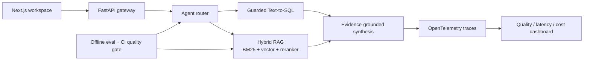

# QueryWeaver

> A verifiable data copilot that routes questions across private documents and SQL databases.

QueryWeaver is a portfolio-grade AI engineering project. It combines hybrid RAG, safe Text-to-SQL, agentic routing, offline evaluation, and production observability in one inspectable system. Every answer is designed to carry evidence, latency, and quality signals—not just fluent text.

## Why this project exists

Most portfolio RAG projects stop at “upload a PDF and chat.” QueryWeaver focuses on the engineering questions interviewers care about:

- How do you decide whether to search documents or query structured data?
- How do you prevent unsafe SQL and unsupported claims?
- How do you measure retrieval and answer quality before shipping?
- How do you trace latency, cost, failures, and model/tool decisions?
- How do you build a system that works locally without hiding everything behind a framework?

## Current milestone: M1 hybrid retrieval

The current vertical slice is intentionally dependency-light and API-key-free:

- deterministic document chunking;
- explainable BM25-style lexical retrieval;
- Chinese character n-gram tokenization;
- provider-agnostic vector retrieval with a deterministic hashing baseline;
- reciprocal-rank fusion (RRF) hybrid retrieval;
- heuristic document/SQL routing;
- read-only SQLite guardrails;
- citation-shaped results;
- retrieval metrics (`hit_rate@k`, `MRR@k`);
- a bilingual benchmark and CI quality gate;
- unit tests and CI.

Run the test suite with Python 3.11+:

```bash
python -m unittest discover -s tests -v
```

Try the core locally:

```python
from queryweaver.ingestion import chunk_document
from queryweaver.retrieval import LexicalRetriever

chunks = chunk_document("handbook", "Refunds are available within 30 days.")
retriever = LexicalRetriever(chunks)
print(retriever.search("What is the refund window?", top_k=3))
```

## Target architecture



## Roadmap

- [x] **M0 — Foundations:** framework-free core, safe SQL boundary, metrics, tests
- [ ] **M1 — Real RAG:** Chinese tokenizer and RRF baseline complete; real embeddings, Qdrant, and reranking next
- [ ] **M2 — Data agent:** schema-aware Text-to-SQL, query repair, result visualization
- [ ] **M3 — Agent workflow:** LangGraph routing, retries, human approval for risky actions
- [ ] **M4 — Evaluation:** golden dataset, RAGAS-style metrics, regression gates
- [ ] **M5 — Observability:** OpenTelemetry/Langfuse traces, token/cost/latency dashboard
- [ ] **M6 — Product:** Next.js UI, streaming, auth, Docker Compose, cloud deployment
- [ ] **M7 — Open source:** demo video, benchmark report, issues, contributor guide

## Repository map

```text
src/queryweaver/       framework-independent Python core
tests/                 deterministic unit tests
docs/                  architecture, learning plan, and interview narrative
.github/workflows/     CI quality gate
```

## Learning contract

This repository is built in milestones. For every milestone, the author should be able to explain the design decision, implement one component without copying, write the tests, and record benchmark results. See [`docs/learning-roadmap.md`](docs/learning-roadmap.md).

## License

MIT
