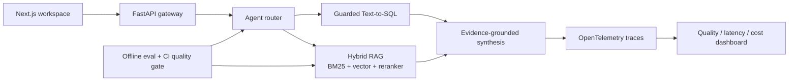

# QueryWeaver

> A verifiable data copilot that routes questions across private documents and SQL databases.

QueryWeaver is a portfolio-grade AI engineering project. It combines hybrid RAG, safe Text-to-SQL, agentic routing, offline evaluation, and production observability in one inspectable system. Every answer is designed to carry evidence, latency, and quality signals—not just fluent text.

## What makes it different

QueryWeaver is not a model API wrapper. Model providers are intentionally replaceable
adapters; the project's value lives in the reliable system around them:

- one question interface routes across unstructured documents and structured databases;
- hybrid retrieval preserves exact-keyword and semantic recall before candidate reranking;
- every document answer exposes source chunks instead of returning unsupported prose;
- generated SQL is treated as untrusted input and must pass AST, schema, function,
  read-only, row-limit, and timeout boundaries;
- deterministic tests run without an API key, while real models plug into the same contracts;
- quality, security, and tail latency are measured with versioned regression datasets.

The product goal is to let an employee ask a business question without knowing whether
the answer lives in a policy document or a relational table, while still giving engineers
enough evidence to verify, reject, benchmark, and diagnose the result.

## Why this project exists

Most portfolio RAG projects stop at “upload a PDF and chat.” QueryWeaver focuses on the engineering questions interviewers care about:

- How do you decide whether to search documents or query structured data?
- How do you prevent unsafe SQL and unsupported claims?
- How do you measure retrieval and answer quality before shipping?
- How do you trace latency, cost, failures, and model/tool decisions?
- How do you build a system that works locally without hiding everything behind a framework?

## Current milestone: M2 end-to-end vertical slice

The current vertical slice is intentionally dependency-light and API-key-free:

- deterministic document chunking;
- explainable BM25-style lexical retrieval;
- Chinese character n-gram tokenization;
- provider-agnostic vector retrieval with a deterministic hashing baseline;
- query/passage-aware FastEmbed adapter for multilingual embeddings;
- persistent or in-memory Qdrant vector index;
- reciprocal-rank fusion (RRF) hybrid retrieval;
- candidate-set reranking with deterministic and FastEmbed cross-encoder adapters;
- heuristic document/SQL routing;
- read-only SQLite guardrails;
- citation-shaped results;
- retrieval metrics (`hit_rate@k`, `MRR@k`);
- a bilingual benchmark and CI quality gate;
- p50/p95/max retrieval latency statistics;
- SQLGlot AST validation, schema/function allowlists, row limits, and query timeouts;
- a 17-case SQL safety regression benchmark;
- a unified application orchestration boundary;
- a FastAPI query API and OpenAPI contract;
- a zero-key browser UI for document citations and SQL result tables;
- unit tests and CI.

Run the complete local demo:

```bash
python -m pip install -e ".[api,dev]"
python -m uvicorn queryweaver.api:app --reload
```

Then open <http://127.0.0.1:8000/>. The demo intentionally uses deterministic,
API-free substitutes so that the complete browser → API → retrieval/SQL → evidence
loop is reproducible. See the [Chinese end-to-end testing guide](docs/local-end-to-end-testing.zh-CN.md).

Run the same full-stack slice in Docker and load-test the real HTTP boundary:

```bash
docker compose up --build --detach
python scripts/run_load_test.py --requests 500 --concurrency 20
```

See the [Chinese deployment and load-testing guide](docs/deployment-load-testing.zh-CN.md).

Run the test suite with Python 3.11+:

```bash
python -m unittest discover -s tests -v
```

Run the offline baseline benchmark:

```bash
python scripts/run_retrieval_benchmark.py --assert-minimum 0.75
```

Run the opt-in semantic benchmark (downloads a public multilingual ONNX model once):

```bash
python -m pip install -e ".[retrieval]"
python scripts/run_semantic_benchmark.py --assert-minimum 0.90
```

Run the SQL safety benchmark:

```bash
python scripts/run_sql_policy_benchmark.py
```

Try the core locally:

```python
from queryweaver.ingestion import chunk_document
from queryweaver.retrieval import LexicalRetriever

chunks = chunk_document("handbook", "Refunds are available within 30 days.")
retriever = LexicalRetriever(chunks)
print(retriever.search("What is the refund window?", top_k=3))
```

## Target architecture



## Roadmap

- [x] **M0 — Foundations:** framework-free core, safe SQL boundary, metrics, tests
- [ ] **M1 — Real RAG:** reranking and latency metrics complete; fixed-runner model report remains
- [ ] **M2 — Data agent:** AST/schema/timeout safety core complete; model generator, repair, and result visualization next
- [ ] **M3 — Agent workflow:** LangGraph routing, retries, human approval for risky actions
- [ ] **M4 — Evaluation:** golden dataset, RAGAS-style metrics, regression gates
- [ ] **M5 — Observability:** OpenTelemetry/Langfuse traces, token/cost/latency dashboard
- [ ] **M6 — Product:** Next.js UI, streaming, auth, Docker Compose, cloud deployment
- [ ] **M7 — Open source:** demo video, benchmark report, issues, contributor guide

## Repository map

```text
src/queryweaver/       framework-independent Python core
tests/                 deterministic unit tests
docs/                  architecture, learning plan, and interview narrative
web/                   zero-build local vertical-slice UI
.github/workflows/     CI quality gate
```

## Learning contract

This repository is built in milestones. For every milestone, the author should be able to explain the design decision, implement one component without copying, write the tests, and record benchmark results. See [`docs/learning-roadmap.md`](docs/learning-roadmap.md) and the detailed [`Chinese project design`](docs/project-design.zh-CN.md).

## License

MIT
