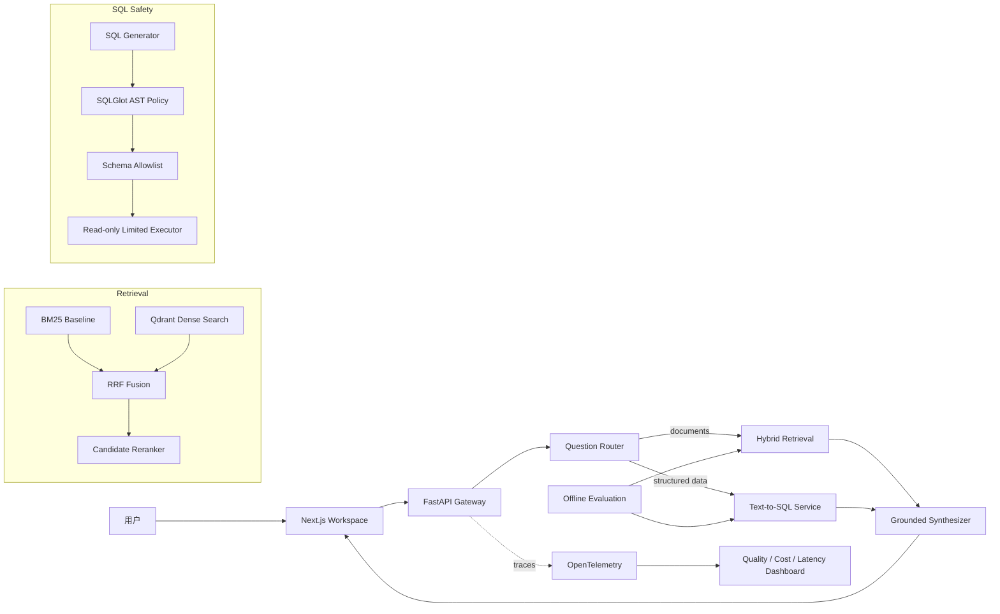
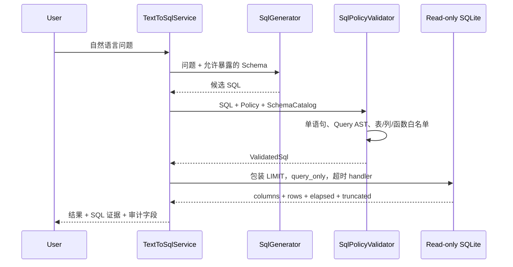

# QueryWeaver 项目详细设计文档

版本：0.4.0  
状态：M1 检索基础设施完成，M2 安全 Text-to-SQL 核心完成  
目标岗位：AI Engineer、LLM Application Engineer、后端/平台工程实习

## 1. 项目摘要

QueryWeaver 是一个面向企业私有数据的可验证智能问答系统。用户可以针对非结构化文档和结构化数据库提出自然语言问题；系统判断应使用文档检索、SQL 查询或组合工具，并返回答案、来源证据、执行轨迹、延迟与质量信号。

项目的重点不是“接入一个大模型聊天接口”，而是解决模型落地中的四类工程问题：

1. 数据来自文档和数据库时，如何正确选择工具；
2. 检索和 SQL 生成出错时，如何检测并阻断；
3. 如何通过离线数据集和 CI 判断一次改动是否造成质量回归；
4. 如何记录延迟、成本、工具调用和失败原因，支持线上诊断。

## 2. 产品目标与非目标

### 2.1 核心目标

- 支持英文和中文文档检索；
- 支持 BM25、向量检索、RRF 融合和候选集 Reranking；
- 支持受 Schema 和执行策略约束的 Text-to-SQL；
- 每个答案携带可追踪的文档 Chunk 或 SQL 证据；
- 具有可重复的质量、延迟和安全 Benchmark；
- 本地无 API Key 也能运行核心测试；
- 生产适配器与领域核心解耦，便于替换模型和基础设施。

### 2.2 当前非目标

- 不允许智能体执行写 SQL；
- 不实现任意网页浏览或系统命令工具；
- 不将模型输出直接视为可信 SQL；
- 不在早期阶段追求 Kubernetes、多 Agent 数量或复杂 UI；
- 不使用未经 Benchmark 证明有效的复杂检索策略。

## 3. 用户与典型场景

### 3.1 业务分析人员

问题：“华东区上季度销售额是多少？”

系统行为：识别为结构化聚合问题，生成 SQL，经过 AST/Schema/函数策略验证，只读执行并返回表格和 SQL 证据。

### 3.2 内部员工

问题：“正式员工和外包人员的年假有什么区别？”

系统行为：检索两份员工制度，融合关键词与语义结果，Reranker 重排，引用相关段落后生成对比答案。

### 3.3 平台维护人员

需求：升级 Embedding 模型。

系统行为：重建派生向量索引，运行 Golden Dataset，对比 Hit Rate、MRR、Recall、p50/p95 延迟；未达到阈值时 CI 或发布门禁失败。

## 4. 总体架构

> 本图同时包含当前核心和目标服务。各方框的完成状态、代码映射、实际组装方式与模型连接过程，参见 [Target Architecture：代码结构与模型连接指南](target-architecture-code-guide.zh-CN.md)。



## 5. 模块边界

| 模块 | 职责 | 当前实现 |
|---|---|---|
| `ingestion.py` | 文档标准化、分块、稳定 ID | 已完成基础版 |
| `retrieval.py` | 中文 Token 与 BM25 | 已完成 |
| `vector.py` | Embedding Provider、内存向量检索 | 已完成 |
| `qdrant_store.py` | Qdrant Collection、Point、Payload | 已完成 |
| `hybrid.py` | RRF 候选融合 | 已完成 |
| `reranking.py` | 候选集重排 | 已完成基线与 FastEmbed Adapter |
| `evaluation.py` | Hit Rate、MRR、Recall、p50/p95 | 已完成 |
| `schema.py` | SQLite Schema Catalog | 已完成 |
| `sql_policy.py` | AST/Schema/函数/执行策略 | 已完成 M2.1 |
| `text_to_sql.py` | SQL 生成、验证、执行编排 | 已完成 Provider 边界 |
| `router.py` | 文档与 SQL 工具路由 | 当前为可解释规则基线 |

## 6. 文档摄取设计

### 6.1 输入

规划支持 Markdown、TXT、PDF、DOCX 和网页快照。解析器输出统一 Document：

```text
document_id
source_uri
mime_type
content_hash
text
metadata
```

### 6.2 分块

当前按句子边界和最大词数确定性分块。Chunk ID 由以下信息计算：

```text
sha256(document_id + position + normalized_text)
```

稳定 ID 的作用：

- 同一输入重复摄取不会产生随机引用；
- 可以判断哪些 Chunk 新增、修改或删除；
- Qdrant Point 可以通过 UUIDv5 稳定映射；
- Trace、评测样本和用户反馈可以长期引用同一个 Chunk。

### 6.3 后续改进

- Parent-Child Chunk；
- 表格和代码块感知分块；
- Content Hash 去重；
- 增量索引和失败恢复；
- PDF 页码、标题层级和坐标引用。

## 7. 检索流水线

### 7.1 第一阶段召回

BM25 擅长产品名、缩写、编号等精确关键词；Dense Embedding 擅长同义改写和跨语言语义。两者并行获得候选集。

中文基线输出字符 unigram 与 bigram，避免整句话被当作单一 Token。它提高召回，但可能引入短字符噪声，因此只能作为可解释基线。

### 7.2 RRF 融合

BM25 与余弦相似度分数不在同一量纲，QueryWeaver 不直接相加，而是使用：

```text
RRF(d) = Σ 1 / (k + rank_i(d))
```

该方法依赖排名而非原始分数，对模型和语料变化更稳定。

### 7.3 候选集 Reranking

第一阶段取 `final_top_k × candidate_multiplier` 个候选；Cross-Encoder 同时读取 Query 和 Document，输出更精确但更昂贵的相关性分数。

关键约束：Reranker 不能找回候选集中不存在的文档。因此要分别监控：

- 候选 Recall@K；
- 重排后的 MRR/NDCG；
- Reranker p50/p95 延迟；
- 每次查询的候选数量。

当前 `TokenOverlapReranker` 用于确定性 CI，`FastEmbedCrossEncoderReranker` 用于真实模型实验。默认建议 MIT 许可的 `BAAI/bge-reranker-base`；模型体积和许可证必须记录在实验报告中。

## 8. 检索评测设计

### 8.1 数据集

当前数据集包含 16 个容易混淆的中英文 Chunk 和 20 个问题，覆盖：

- 精确关键词；
- 中英文表达；
- 同主题不同规则，例如普通退款与数字订阅退款；
- 身份差异，例如正式员工与承包人员；
- 同义改写和无关键词重叠问题。

### 8.2 指标

- `Hit Rate@K`：Top-K 是否至少命中一个相关 Chunk；
- `MRR@K`：第一个相关结果出现得多早；
- `Recall@K`：多个相关 Chunk 被找回多少；
- `p50`：典型延迟；
- `p95`：尾部慢请求；
- `max`：异常最慢样本。

百分位采用 nearest-rank 定义，避免不同统计库默认插值方式造成报告不可比。

### 8.3 当前离线基线

| Retriever | Hit Rate@3 | MRR@3 | Recall@3 |
|---|---:|---:|---:|
| BM25 | 0.900 | 0.850 | 0.900 |
| Hashing Vector | 0.850 | 0.800 | 0.850 |
| Hybrid RRF | 0.900 | 0.825 | 0.900 |
| Hybrid + Token Reranker | 0.900 | 0.825 | 0.900 |

Token Reranker 没有提升语义指标是预期且诚实的结果。它验证了候选放大、分数回填和重排接口；真实提升应由 Cross-Encoder 实验给出。

## 9. Text-to-SQL 数据流



## 10. SQL 安全模型

### 10.1 威胁

- 模型生成 `DELETE`、`UPDATE`、`DROP`；
- 通过分号堆叠第二条语句；
- 查询未授权表或系统表；
- 使用 `SELECT *` 意外暴露敏感列；
- 调用 `load_extension`、文件或危险函数；
- 使用大规模笛卡尔积拖垮服务；
- 通过错误列名或幻觉 Schema 产生不可执行 SQL。

### 10.2 控制

| 层 | 控制 | 能阻止的问题 |
|---|---|---|
| Parser | SQLGlot 指定方言并解析 AST | 语法错误、多语句 |
| Statement | 根节点必须是 `Query` | DDL、DML、PRAGMA、ATTACH |
| Schema | 物理表和列必须在 Catalog | 越权表、幻觉字段 |
| Projection | 默认禁止 `SELECT *` | 宽表敏感字段泄露 |
| Function | 默认最小函数白名单 | 扩展加载和危险函数 |
| Execution | `PRAGMA query_only = ON` | 数据库写入 |
| Result | 外层强制 `LIMIT max_rows + 1` | 结果集过大 |
| Runtime | SQLite Progress Handler | 长时间运行查询 |
| Audit | 返回规范化 SQL、表、列、耗时 | 复盘与告警 |

### 10.3 为什么 AST 仍然不够

SQLGlot 是 Parser/Transpiler，不是数据库验证器。AST 能理解结构，但不能证明表真实存在、权限正确或查询代价合理。因此必须叠加 Schema Catalog、数据库只读账户、超时和结果限制。生产环境还需增加 `EXPLAIN` 成本门禁和 PostgreSQL `statement_timeout`。

## 11. 核心数据契约

### 11.1 SearchHit

```text
chunk: Chunk
score: float
```

分数只在当前阶段内部比较。经过 RRF 或 Reranker 后，score 的语义会改变，API 必须额外返回 `score_type` 或 Trace Span，避免前端误比较不同阶段的数值。

### 11.2 ValidatedSql

```text
sql: canonical SQL
tables: accessed physical tables
columns: referenced columns
```

### 11.3 SqlExecutionResult

```text
columns: output column names
rows: bounded result rows
elapsed_ms: database execution time
truncated: whether max_rows hid additional rows
```

## 12. 计划中的 HTTP API

### `POST /v1/documents`

上传文档并创建异步摄取任务。返回 `document_id`、`job_id` 和状态。

### `POST /v1/query`

请求：

```json
{
  "workspace_id": "demo",
  "question": "华东区销售额是多少？",
  "top_k": 5
}
```

响应：

```json
{
  "answer": "...",
  "route": "sql",
  "evidence": [],
  "sql": "SELECT ...",
  "trace_id": "...",
  "latency_ms": 42.1
}
```

### `POST /v1/evaluations`

启动离线评测；结果包含数据集版本、Git SHA、模型配置、各项指标和失败案例。

## 13. 可观测性规划

每次请求建立根 Span，并包含：

- `route.decision`；
- `retrieval.lexical`；
- `retrieval.vector`；
- `retrieval.fusion`；
- `retrieval.rerank`；
- `sql.generate`；
- `sql.validate`；
- `sql.execute`；
- `answer.synthesize`。

关键属性：模型名、Prompt 版本、候选数、Top-K、Token、费用、p50/p95、表名、截断状态和错误类别。不得把完整敏感文档或数据库行默认写入 Trace。

## 14. 测试与 CI

质量门禁顺序：

1. Ruff 静态规范；
2. mypy strict 类型检查；
3. 无网络单元测试；
4. 检索 Benchmark 阈值；
5. SQL Policy Benchmark 全量通过。

真实模型 Benchmark 不放入普通 CI，因为首次运行需要下载模型，且硬件差异会影响延迟。未来可在固定 Runner 上夜间执行。

## 15. 部署设计

### 本地开发

- Python Core + FastAPI；
- Qdrant local mode 或 Docker；
- SQLite Demo 数据；
- Next.js 前端。

### 生产形态

- API：FastAPI 多副本；
- Worker：文档解析、Embedding、评测任务；
- PostgreSQL：用户、Workspace、元数据、审计；
- Qdrant：向量与 Payload 索引；
- Object Storage：原始文件；
- Redis：任务队列、速率限制和短期缓存；
- OpenTelemetry Collector：Trace/Metrics/Logs。

### 隔离原则

- 每个 Workspace 使用 Payload Filter 或独立 Collection；
- 数据库连接使用只读角色；
- API Key 只存在服务端 Secret Store；
- Trace 默认脱敏；
- 上传文件解析在资源受限 Worker 中执行。

## 16. 性能预算

初始目标，不作为当前已达成结果：

| 阶段 | p50 | p95 |
|---|---:|---:|
| 路由 | 20 ms | 80 ms |
| 第一阶段检索 | 50 ms | 150 ms |
| Reranker | 100 ms | 350 ms |
| SQL 验证 | 10 ms | 30 ms |
| SQL 执行 | 100 ms | 500 ms |
| 完整首 Token | 800 ms | 2,000 ms |

所有预算必须在固定硬件、固定数据集、固定并发下重新测量。

## 17. 里程碑与验收标准

### M1：检索可靠性

- [x] BM25、向量接口和 RRF；
- [x] 中文基线；
- [x] Qdrant Adapter；
- [x] Reranker Adapter；
- [x] Hit Rate/MRR/Recall/p50/p95；
- [ ] 固定环境运行真实多语言 Embedding + Cross-Encoder 报告；
- [ ] 扩展至至少 100 个人工审核问题。

### M2：安全 Text-to-SQL

- [x] Schema Catalog；
- [x] AST、表、列、函数策略；
- [x] 行数、只读、超时控制；
- [x] 17 个 SQL Policy Benchmark；
- [ ] 接入真实模型 Generator；
- [ ] SQL 执行准确率数据集；
- [ ] Query Repair 最多一次且必须重新验证；
- [ ] PostgreSQL 只读角色与 `statement_timeout`。

### M3：Agent 与产品

- [ ] LangGraph 状态机；
- [ ] 引用约束的答案生成；
- [ ] FastAPI 流式接口；
- [ ] Next.js Evidence/Trace UI；
- [ ] Docker Compose 一键启动。

### M4：可观测与发布

- [ ] OpenTelemetry；
- [ ] 质量、成本、延迟 Dashboard；
- [ ] 云端 Demo；
- [ ] 演示视频与架构讲解；
- [ ] 真实 Benchmark 报告和简历量化数据。

## 18. 已知风险与缓解

| 风险 | 影响 | 缓解 |
|---|---|---|
| 测试集过小 | 指标虚高 | 增加真实失败样本和人工审核 |
| Reranker 许可证限制 | 无法商用 | 优先 MIT/Apache 模型并记录许可证 |
| Schema 频繁变化 | SQL 幻觉 | Catalog 版本化和缓存失效 |
| CTE/别名复杂 | 列归属误判 | 后续使用 SQLGlot Scope/Qualify |
| 查询代价过高 | 数据库压力 | EXPLAIN 门禁、只读副本、超时 |
| Trace 泄露数据 | 安全事故 | 默认仅记录 ID、Hash 和统计信息 |
| 指标不可复现 | 简历数据失真 | 固定数据、配置、Git SHA 和硬件信息 |

## 19. 面试讲述建议

不要只说“用了 Qdrant、FastEmbed 和 SQLGlot”。建议按以下结构展开：

1. 问题：单一向量检索对精确词不稳定，LLM 生成 SQL 又存在越权风险；
2. 决策：BM25 + Dense + RRF + 候选重排，SQL 使用 AST 与执行层纵深防御；
3. 验证：20 个检索问题、17 个 SQL Policy Case、CI 质量门禁；
4. 结果：给出 Hit Rate/MRR/Recall 与 p50/p95，并解释为什么 Token Reranker 暂未提升；
5. 失败：模型下载源不可达、FastEmbed 模型注册差异、mypy 第三方类型边界；
6. 改进：固定模型 Runner、扩大 Golden Dataset、PostgreSQL 权限和 Agent Trace。

这种讲法能体现你理解系统为什么这样设计，而不只是会调用框架。
