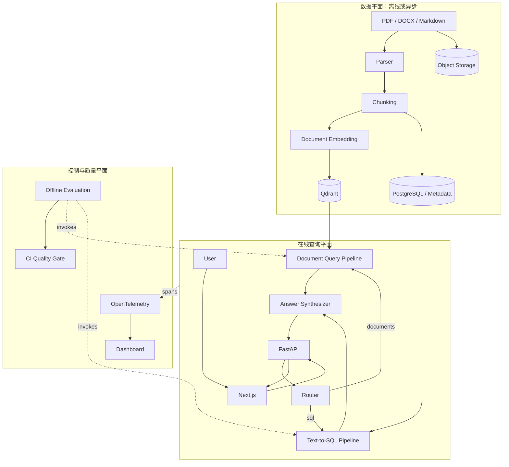
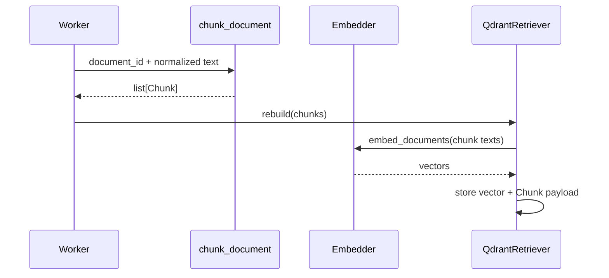
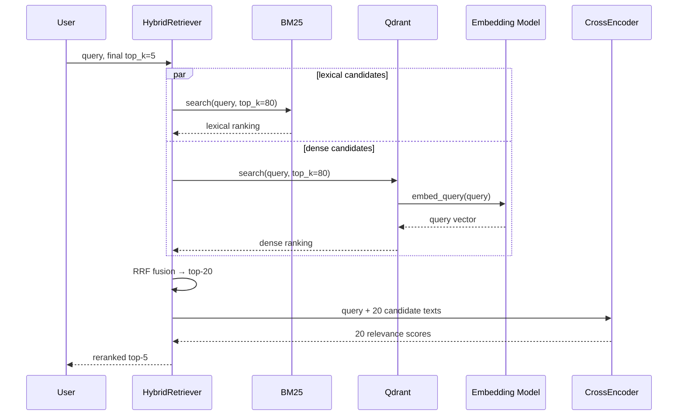
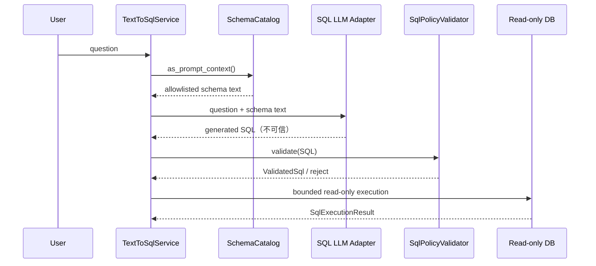

# Target Architecture：代码结构与模型连接指南

版本：0.5.0  
目的：把架构图中的方框、运行时调用链、Python 文件和模型连接一一对应。

## 1. 先理解：Target Architecture 不是当前完成度截图

Target Architecture 描述项目最终希望达到的形态，其中只有一部分已经实现。

| 状态 | 含义 |
| --- | --- |
| 已实现 | 已有核心代码和测试，可在本地无网络运行 |
| 已有接口 | 调用边界已定义，但真实模型或生产适配器尚未接入 |
| 规划中 | 设计目标，当前仓库还没有对应服务 |

当前已经完成 Python 领域核心和本地纵向闭环：文档切分、检索、重排、评测、SQL 安全、统一 Application、FastAPI 与零构建浏览器 UI。真实答案生成模型、Next.js、Agent 状态机、OpenTelemetry 和生产数据库仍属于后续阶段。

## 2. 总体结构：三个平面、两条在线路径



三个平面的职责：

- **数据平面**把原始文件转成可检索的 Chunk 和向量，不应阻塞在线请求。
- **在线查询平面**处理用户问题，只读取已经准备好的索引和只读数据库。
- **控制与质量平面**负责 benchmark、CI、trace 和告警，不参与业务答案本身。

在线有两条路径：文档问题走 RAG 检索，统计问题走安全 Text-to-SQL。最终两条路径都要进入答案合成器，但输入证据不同。

## 3. 架构方框与当前代码映射

| 架构组件 | 当前文件/类 | 输入 | 输出 | 状态 |
| --- | --- | --- | --- | --- |
| Chunking | `ingestion.py::chunk_document` | document ID、文本 | `list[Chunk]` | 已实现 |
| BM25 | `retrieval.py::LexicalRetriever` | Chunk、query | `list[SearchHit]` | 已实现 |
| Embedding | `vector.py::Embedder` | 文本 | 浮点向量 | 已有接口 |
| 本地 Embedding | `vector.py::FastEmbedEmbedder` | 文本 | ONNX 模型向量 | 已实现适配器 |
| 测试 Embedding | `vector.py::HashingEmbedder` | 文本 | 确定性哈希向量 | 已实现，非语义模型 |
| Vector DB | `qdrant_store.py::QdrantRetriever` | query 向量 | `list[SearchHit]` | 已实现适配器 |
| RRF | `hybrid.py::HybridRetriever` | 两组排名 | 融合候选 | 已实现 |
| Reranker | `reranking.py::Reranker` | query、候选 Chunk | 重排结果 | 已有接口 |
| CrossEncoder | `reranking.py::FastEmbedCrossEncoderReranker` | query-document pairs | 相关性分数 | 已实现适配器 |
| Router | `router.py::route_question` | 用户问题 | `Route` | 已实现规则基线 |
| Schema Catalog | `schema.py::SchemaCatalog` | DB metadata | 允许暴露的表列 | 已实现 SQLite 版 |
| SQL Generator | `text_to_sql.py::SqlGenerator` | 问题、schema context | SQL 字符串 | 仅接口，真实 LLM 未接入 |
| SQL Validator | `sql_policy.py::SqlPolicyValidator` | 模型 SQL | `ValidatedSql` | 已实现 |
| SQL Executor | `sql_policy.py::execute_validated_sql` | 验证后的 SQL | 有界结果 | 已实现 SQLite 版 |
| Query Orchestrator | `application.py::QueryWeaverApplication` | 用户请求 | 统一响应 | 已实现 |
| Answer Synthesizer | `application.py::AnswerSynthesizer` | 问题、证据 | 带引用答案 | 已有接口和确定性替身 |
| Demo Composition | `demo.py::create_demo_application` | 本地内存数据 | 可运行应用对象 | 已实现 |
| HTTP API | `api.py::create_api` | HTTP | JSON | 已实现本地版，SSE待实现 |
| Web UI | `web/` | 用户交互 | Evidence/SQL UI | 已实现静态版，Next.js待实现 |

这里最重要的区别是：**接口不等于模型已经连接**。例如 `SqlGenerator` 只规定模型连接器必须提供什么方法，真实云端或本地 LLM Adapter 仍需要在 M2 中实现。

## 4. 核心数据对象怎样流动

当前核心对象位于 `models.py`：

```text
原始文本
  ↓ chunk_document
Chunk(id, document_id, text, position)
  ↓ Retriever.search
SearchHit(chunk, score)
  ↓ RRF / Reranker
SearchHit(chunk, new_stage_score)
```

SQL 路径的数据变化是：

```text
question + SchemaCatalog
  ↓ SqlGenerator.generate
generated_sql: str                    ← 不可信
  ↓ SqlPolicyValidator.validate
ValidatedSql(sql, tables, columns)    ← 通过应用策略
  ↓ execute_validated_sql
SqlExecutionResult(columns, rows, elapsed_ms, truncated)
```

注意：模型输出永远停留在“不可信”一侧。只有通过 Validator 的 `ValidatedSql` 才能进入 Executor。

## 5. 文档摄取链路：模型第一次连接在哪里

摄取是写路径，通常由后台 Worker 执行：



当前代码可以这样组装：

```python
from pathlib import Path

from queryweaver.ingestion import chunk_document
from queryweaver.qdrant_store import QdrantRetriever
from queryweaver.vector import FastEmbedEmbedder

chunks = chunk_document("refund-policy", document_text)

embedder = FastEmbedEmbedder(
    model_name="sentence-transformers/paraphrase-multilingual-MiniLM-L12-v2",
    cache_dir=Path(".models/fastembed"),
)
dense = QdrantRetriever(
    embedder,
    collection_name="demo_chunks",
    location="http://localhost:6333",
)
dense.rebuild(chunks)
```

模型连接发生在 `FastEmbedEmbedder.__init__`：它创建 FastEmbed `TextEmbedding`；`embed_documents` 调用 `passage_embed`，`embed_query` 调用 `query_embed`。Qdrant 不负责运行模型，它只通过 `Embedder` 接口取得向量并保存或查询。

这样拆分的原因是模型和向量库有独立生命周期：替换 Embedding 模型通常需要重建向量，但更换 Qdrant 部署地址不应改模型代码。

## 6. 文档查询链路：Embedding、RRF、Reranker 怎样串联



对应组装代码：

```python
from queryweaver.hybrid import HybridRetriever
from queryweaver.reranking import (
    FastEmbedCrossEncoderReranker,
    RerankingRetriever,
)
from queryweaver.retrieval import LexicalRetriever

lexical = LexicalRetriever(chunks)

# dense 是上一节构造的 QdrantRetriever。
hybrid = HybridRetriever(
    lexical,
    dense,
    candidate_multiplier=4,
    rrf_k=60,
)
reranker = FastEmbedCrossEncoderReranker(
    model_name="BAAI/bge-reranker-base",
    cache_dir=Path(".models/fastembed"),
)
retriever = RerankingRetriever(
    hybrid,
    reranker,
    candidate_multiplier=4,
)

hits = retriever.search("数字订阅的退款期限是什么？", top_k=5)
```

候选数量要从外向内理解：

```text
最终要 5 条
RerankingRetriever 向 HybridRetriever 要 5 × 4 = 20 条
HybridRetriever 分别向 BM25 和 Qdrant 要 20 × 4 = 80 条
两路最多 160 条 → RRF 去重并取 20 条 → CrossEncoder 重排 → 最终 5 条
```

这个例子说明两个 `candidate_multiplier` 位于不同层，作用也不同。生产配置不应盲目都设为 4，而要用 Recall、MRR 和 p95 实验决定。

## 7. 文档答案生成：当前尚缺的模型连接

检索结果不是最终答案。目标架构还需要一个 `AnswerSynthesizer`：

```python
from typing import Protocol, Sequence

from queryweaver.models import SearchHit


class AnswerSynthesizer(Protocol):
    def answer_documents(
        self,
        question: str,
        evidence: Sequence[SearchHit],
    ) -> str: ...
```

未来真实连接器负责：

1. 把 top-k Chunk 转成带固定引用 ID 的 context；
2. 调用聊天/生成模型；
3. 要求结构化返回 `answer + citation_ids`；
4. 检查 citation ID 必须来自实际候选；
5. 没有足够证据时明确拒答。

当前 `DeterministicSynthesizer` 会把真实 Chunk ID 和文本组织成可检查答案，用来验证端到端链路；真实生成模型 Adapter 尚未实现，因此不能把 Demo 的文本质量当作最终 RAG 效果。

## 8. Text-to-SQL：LLM 到底接在哪里

Text-to-SQL 不是把数据库连接交给模型，而是只把经过筛选的 Schema 文本交给模型：



当前已经定义连接器接口：

```python
class SqlGenerator(Protocol):
    def generate(self, question: str, schema_context: str) -> str: ...
```

测试中的 `RecordingGenerator` 是 Fake：它返回固定 SQL，用于证明生成之后一定经过校验和执行。M2 下一步需要实现真实 Adapter，例如：

```python
class ProviderSqlGenerator:
    def __init__(self, chat_model: ChatModel, *, dialect: str) -> None:
        self.chat_model = chat_model
        self.dialect = dialect

    def generate(self, question: str, schema_context: str) -> str:
        # 真实实现应要求结构化输出，并固定 prompt/version/model。
        response = self.chat_model.generate(
            system_prompt=build_sql_prompt(self.dialect, schema_context),
            user_prompt=question,
        )
        return response.sql
```

然后注入现有 Service：

```python
generator = ProviderSqlGenerator(chat_model, dialect="sqlite")
service = TextToSqlService(
    connection=read_only_connection,
    generator=generator,
    catalog=allowed_catalog,
    policy=SqlPolicy(dialect="sqlite", max_rows=100, timeout_ms=1_000),
)
answer = service.execute("按地区统计销售额")
```

`TextToSqlService` 不知道使用哪家模型，也不持有 API Key；它只依赖 `SqlGenerator`。API Key 和模型客户端应在应用启动时由 composition root 创建，然后注入 Adapter。

## 9. 系统中实际需要几种模型

| 模型角色 | 输入 | 输出 | 调用路径 | 当前连接 |
| --- | --- | --- | --- | --- |
| Embedding | query 或 Chunk 文本 | 向量 | 摄取、文档检索 | FastEmbed Adapter 已有 |
| Reranker/CrossEncoder | query + 候选文本 | 相关性分数 | 文档检索 | FastEmbed Adapter 已有 |
| SQL Generator LLM | question + allowlisted schema | SQL | SQL 路径 | 只有 Protocol |
| Answer Synthesizer LLM | question + 检索/SQL证据 | 答案 + 引用 | 两条路径末端 | 规划中 |
| Router Model（可选） | question | route + confidence | 请求入口 | 当前使用规则，不急于上模型 |

不要用一个模型对象承担全部职责。Embedding、CrossEncoder 和生成式 LLM 的输入输出、成本与部署方式完全不同，应使用独立接口和独立配置。

## 10. Composition Root：所有组件应该在哪里组装

领域类不应该自己读取环境变量或偷偷创建模型。目标代码需要一个明确的组装入口：

```text
Settings
  ├─ 创建 Embedder
  ├─ 创建 QdrantRetriever
  ├─ 创建 HybridRetriever
  ├─ 创建 Reranker / RerankingRetriever
  ├─ 创建只读 DB Connection + SchemaCatalog
  ├─ 创建 ChatModel + SqlGenerator
  ├─ 创建 TextToSqlService
  ├─ 创建 AnswerSynthesizer
  └─ 注入 QueryWeaverApplication
```

目标伪代码：

```python
def create_application(settings: Settings) -> QueryWeaverApplication:
    embedder = create_embedder(settings.embedding)
    dense = create_qdrant_retriever(settings.qdrant, embedder)
    lexical = load_lexical_index(settings.workspace_id)
    retrieval = RerankingRetriever(
        HybridRetriever(lexical, dense),
        create_reranker(settings.reranker),
    )

    read_only_db = create_read_only_connection(settings.database)
    catalog = load_allowed_schema(read_only_db, settings.allowed_tables)
    text_to_sql = TextToSqlService(
        read_only_db,
        create_sql_generator(settings.sql_model),
        catalog=catalog,
        policy=settings.sql_policy,
    )

    return QueryWeaverApplication(
        router=route_question,
        retriever=retrieval,
        text_to_sql=text_to_sql,
        synthesizer=create_answer_synthesizer(settings.answer_model),
    )
```

当前 `demo.py::create_demo_application` 已承担本地 Composition Root：它装配 Hashing Embedding、Token Reranker、内存 SQLite 和确定性生成替身。生产版仍需增加类型化 Settings、真实 Provider Factory、生命周期管理和 Secret 注入。

## 11. 统一在线调用链

目标 `QueryWeaverApplication.ask()` 应只负责编排：

```python
def ask(self, question: str) -> QueryResponse:
    route = self.router(question)
    if route is Route.DOCUMENTS:
        hits = self.retriever.search(question, top_k=5)
        return self.synthesizer.answer_documents(question, hits)

    sql_answer = self.text_to_sql.execute(question)
    return self.synthesizer.answer_sql(question, sql_answer)
```

FastAPI 的 `/v1/query` 只调用 `application.ask()`，不能重新实现检索、SQL 安全或模型 Prompt。这样 CLI、API、测试和 benchmark 才能复用同一条核心链路。

## 12. 配置与密钥应该怎样放

建议的目标配置：

```text
QW_EMBEDDING_MODEL=...
QW_RERANKER_MODEL=...
QW_SQL_MODEL=...
QW_ANSWER_MODEL=...
QW_QDRANT_URL=...
QW_DATABASE_URL=...
MODEL_PROVIDER_API_KEY=...  # 只存在本地环境或 Secret Store
```

配置中还必须保存模型版本、Prompt 版本、超时、candidate count、top-k 和 SQL Policy。Benchmark 报告要连同 Git SHA 和数据集版本一起记录，否则指标无法复现。

禁止：

- 把 API Key 写进 Python、`.env.example` 或 Git；
- 让领域模块直接读取任意环境变量；
- 在每个请求中重新加载本地 Embedding/Reranker 模型；
- 在升级 Embedding 模型后继续使用旧向量 Collection；
- 把模型生成 SQL 直接交给数据库；
- 把完整敏感文档或数据库行写进 Trace。

## 13. 目标目录结构

```text
src/queryweaver/
├── domain/                 # Chunk、SearchHit、响应等纯数据对象
├── ingestion/              # parser、chunker、indexing workflow
├── retrieval/              # lexical、dense、fusion、reranker
├── sql/                    # schema、generator、policy、executor
├── application.py          # 两条路径的统一编排
├── generation.py           # 带引用答案合成接口与适配器
├── providers/              # FastEmbed、模型 SDK、Qdrant、DB adapters
├── settings.py             # 类型化配置
└── api/                    # FastAPI route、request/response、SSE

web/                        # Next.js，独立前端工程
tests/                      # unit / integration / contract
benchmarks/                 # 数据集与离线评测
```

当前仓库文件较少，保持扁平结构便于学习。只有在新增 application、providers 和 API 后再逐步迁移，不要为了目录看起来“企业级”提前做无价值重构。

## 14. 当前实现到 Target Architecture 的最短路径

按依赖顺序推进：

1. **真实检索模型实验**：真正运行 FastEmbed Embedding 和 CrossEncoder，产出质量/延迟报告。
2. **SQL 模型 Adapter**：实现一个真实 `SqlGenerator`，增加结构化输出与有限修复。
3. **真实答案 Adapter**：替换确定性 Synthesizer，要求结构化引用并校验引用 ID。
4. **生产 Composition Root**：增加 Settings、provider factory、资源关闭和 Secret 注入。
5. **API 演进**：在现有 HTTP 闭环上增加 SSE、认证、workspace 和标准错误码。
6. **Worker 与存储**：把摄取、Embedding 和 benchmark 从 API 进程移出。
7. **Agent/Trace/Next.js**：增加状态机、OpenTelemetry 和独立产品界面。

当前 v0.5 已是可测试的本地端到端应用；完成第 4–7 步后，才是具备真实模型、资源生命周期和服务边界的生产候选架构。

## 15. 你需要能回答的架构问题

1. 为什么 Embedding 和 Qdrant 是两个 Adapter？
2. 为什么 BM25 与 dense 分数不能直接相加，而采用 RRF？
3. 为什么 CrossEncoder 放在候选集之后？
4. `candidate_multiplier` 在两层分别放大了什么？
5. 为什么 `SqlGenerator` 不能拿数据库连接？
6. 为什么 AST 校验通过后仍需要只读账号、LIMIT 和 timeout？
7. 为什么 FastAPI 不应该包含核心业务逻辑？
8. 替换 Embedding 模型时，哪些数据必须重建？
9. 如何证明一次模型升级没有造成质量回归？
10. 哪些模块当前只是接口或规划，不能在简历中写成“已经实现”？

如果你能根据代码独立画出两条 sequence diagram，并回答以上问题，就真正理解了 QueryWeaver 的 Target Architecture。
